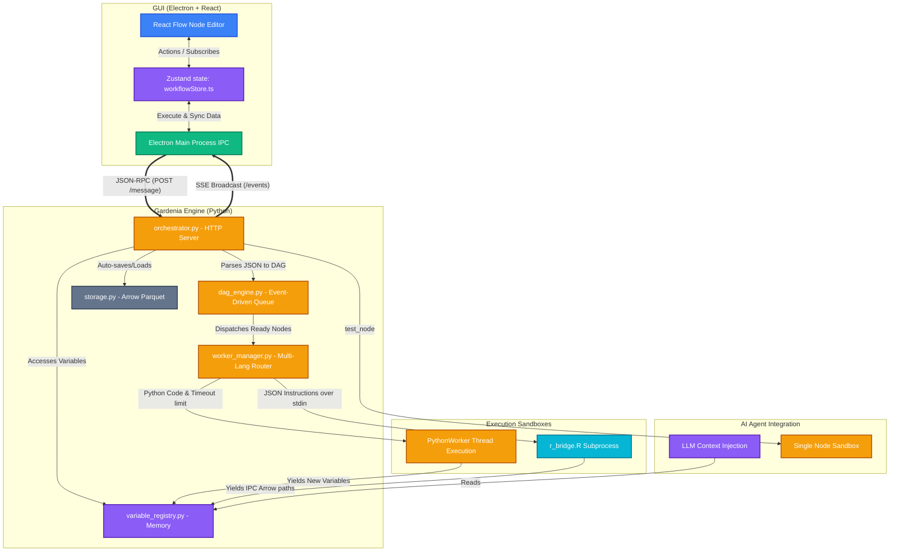

# Gardenia Engine Architecture

```mermaid
graph TD
    %% Define Styles
    classDef frontend fill:#3b82f6,stroke:#1d4ed8,stroke-width:2px,color:white;
    classDef state fill:#8b5cf6,stroke:#5b21b6,stroke-width:2px,color:white;
    classDef bridge fill:#10b981,stroke:#047857,stroke-width:2px,color:white;
    classDef python fill:#f59e0b,stroke:#b45309,stroke-width:2px,color:white;
    classDef rlang fill:#06b6d4,stroke:#0e7490,stroke-width:2px,color:white;
    classDef storage fill:#64748b,stroke:#334155,stroke-width:2px,color:white;

    %% Subgraph: Electron + React Frontend
    subgraph Frontend ["GUI (Electron + React)"]
        UI[React Flow Node Editor]:::frontend
        Store[Zustand state: workflowStore.ts]:::state
        IPC_Main[Electron Main Process IPC]:::bridge
        
        UI <-->|Actions / Subscribes| Store
        Store <-->|Execute & Sync Data| IPC_Main
    end

    %% Subgraph: Python Orchestrator
    subgraph Backend ["Gardenia Engine (Python)"]
        Orchestrator[orchestrator.py - HTTP Server]:::python
        DAG[dag_engine.py - Event-Driven Queue]:::python
        WM[worker_manager.py - Multi-Lang Router]:::python
        Reg[variable_registry.py - Memory]:::state
        StoreEngine[storage.py - Arrow Parquet]:::storage
        
        %% Orchestrator Internal Flow
        Orchestrator -->|Parses JSON to DAG| DAG
        Orchestrator -->|Accesses Variables| Reg
        Orchestrator -->|Auto-saves/Loads| StoreEngine
        
        DAG -->|Dispatches Ready Nodes| WM
    end

    %% Subgraph: Execution Workers
    subgraph Workers ["Execution Sandboxes"]
        PyWorker[PythonWorker Thread Execution]:::python
        RWorker[r_bridge.R Subprocess]:::rlang
        
        WM -->|Python Code & Timeout limit| PyWorker
        WM -->|JSON Instructions over stdin| RWorker
        
        PyWorker -->|Yields New Variables| Reg
        RWorker -->|Yields IPC Arrow paths| Reg
    end

    %% Subgraph: AI Agent Module (New)
    subgraph AIAgent ["AI Agent Integration"]
        Context[LLM Context Injection]:::state
        Sandbox[Single Node Sandbox]:::python
        
        Context -->|Reads| Reg
        Orchestrator -->|test_node| Sandbox
    end

    %% Connections across boundaries
    IPC_Main == "JSON-RPC (POST /message)" ==> Orchestrator
    Orchestrator == "SSE Broadcast (/events)" ==> IPC_Main
```
